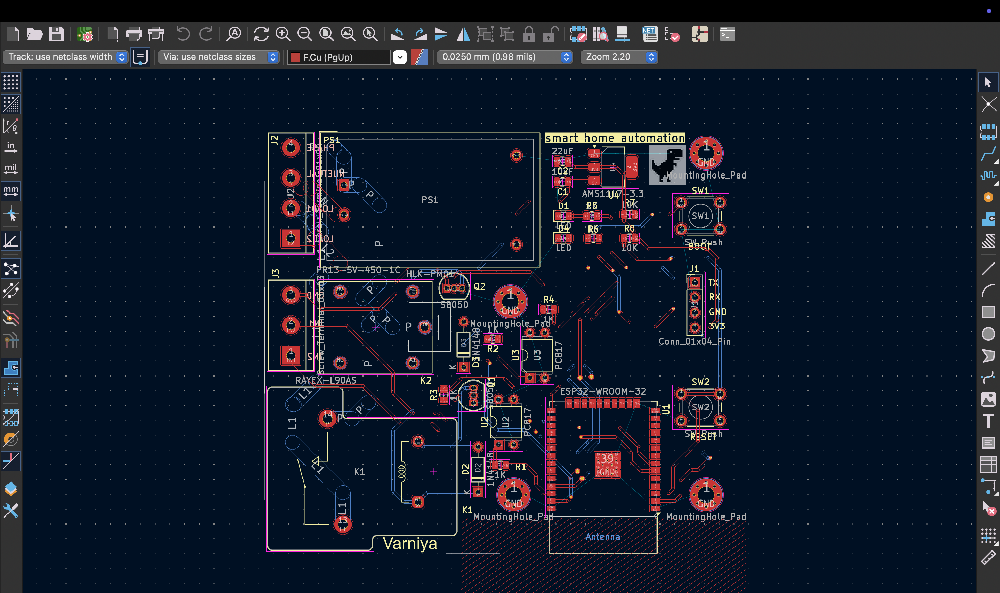
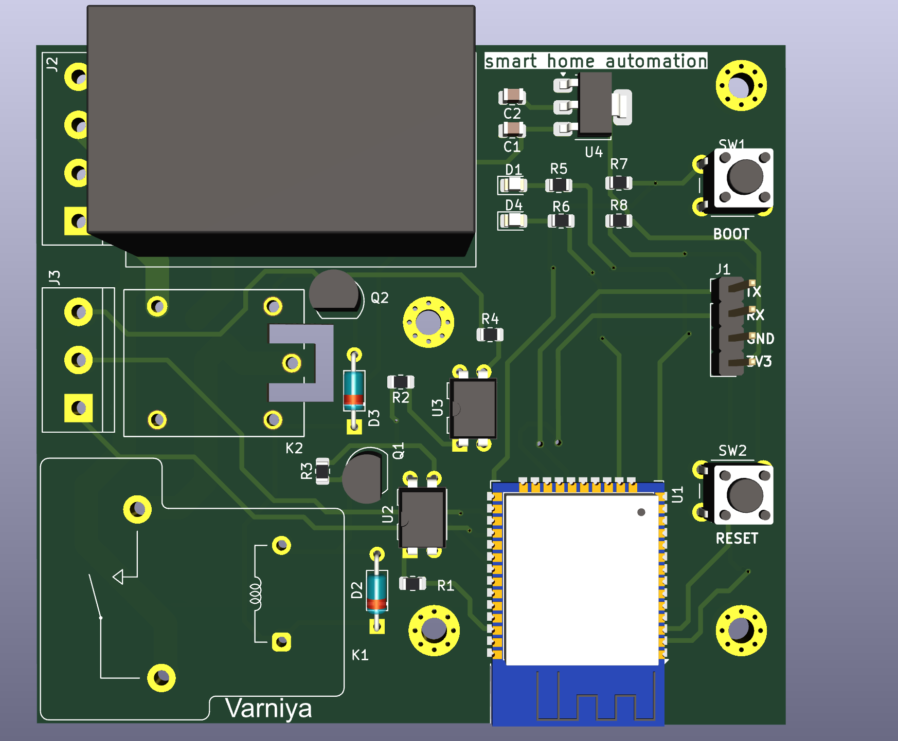

# 🏠 Smart Home Automation PCB

<p align="center">
  
  
  
  
</p>

---

# 📖 Overview

This project is a custom-designed **ESP32-based Smart Home Automation PCB** created using **KiCad 9**.

The board integrates an ESP32 microcontroller with an AC-to-DC power supply, voltage regulation, relay driver circuit, UART programming interface, and user controls for reliable IoT-based home automation.

---

# ✨ Features

- ESP32-WROOM-32 Microcontroller
- HLK-PM03 AC to DC Converter
- AMS1117-3.3V Voltage Regulator
- Relay Driver Circuit
- Boot & Reset Buttons
- UART Programming Header
- Two-Layer PCB
- Compact Board Layout
- Mounting Holes

---

# 🛠 Software Used

- KiCad 9
- Git
- GitHub

---

# 🔩 Hardware Components

- ESP32-WROOM-32
- HLK-PM03 AC-DC Module
- AMS1117-3.3V
- Relay
- BC817 Transistor
- LEDs
- Resistors
- Capacitors
- Push Buttons
- UART Header

---

# 📷 Schematic

<p align="center">

</p>

---

# 📷 PCB Layout

<p align="center">

</p>

---

# 📷 3D PCB View

<p align="center">

</p>

---

# ⚙️ Working Principle

1. The AC mains supply is converted into regulated DC using the **HLK-PM03 AC-DC converter**.
2. The **AMS1117-3.3V** regulator provides a stable 3.3V supply for the ESP32.
3. The ESP32 receives commands through Wi-Fi.
4. GPIO pins control the relay driver transistor.
5. The relay switches external electrical appliances.
6. Boot and Reset buttons simplify programming and debugging.
7. The UART header enables firmware uploading and serial monitoring.

---

# 📂 Repository Structure

```text
Smart-Home-Automation-PCB
│
├── BOM/
│
├── Gerber/
│
├── Images/
│   ├── PCB_Top.png
│   ├── PCB_3D.png
│   └── smart home automation.svg
│
├── KiCad_Project/
│   ├── smart home automation.kicad_pcb
│   ├── smart home automation.kicad_pro
│   ├── smart home automation.kicad_prl
│   ├── smart home automation.kicad_sch
│   └── smart home automation-backups
│
└── README.md
```

---

# 📦 Gerber Files

The complete Gerber package required for PCB manufacturing is included in the **Gerber** folder.

Supported manufacturers include:

- JLCPCB
- PCBWay
- ALLPCB
- NextPCB

---

# 🚀 Applications

- Smart Home Automation
- IoT Systems
- Embedded Systems
- ESP32 Development
- PCB Design Learning
- Electronics Education

---

# 📚 Skills Demonstrated

- PCB Design using KiCad
- Schematic Capture
- Component Selection
- PCB Routing
- Design Rule Check (DRC)
- Gerber File Generation
- PCB Manufacturing Preparation
- Embedded Hardware Design

---

# 🔮 Future Improvements

- MQTT Integration
- Mobile Application
- Energy Monitoring
- OTA Firmware Updates
- Current & Voltage Sensing
- Voice Assistant Integration
- Smart Scheduling

---

# 👩‍💻 Author

## Varniya Bhatnagar

**B.E. Electronics & Communication Engineering**  
Panjab University

### Connect with me

- 📧 Email: **varniyaece@gmail.com**
- 💼 LinkedIn: https://www.linkedin.com/in/varniya-bhatnagar-1ab361327/
- 🐙 GitHub: https://github.com/varniya07

---

## ⭐ Support

If you found this project useful, consider giving it a ⭐ and following my GitHub profile for more Electronics, PCB Design, Embedded Systems, and VLSI projects.
